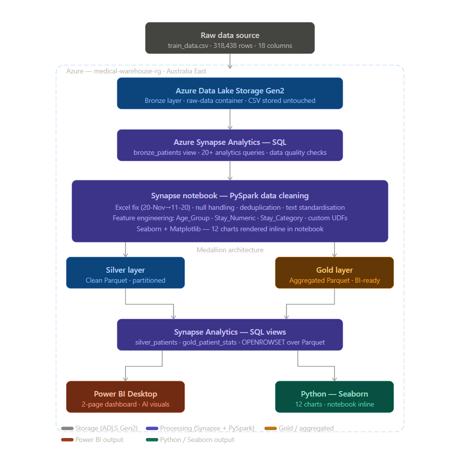
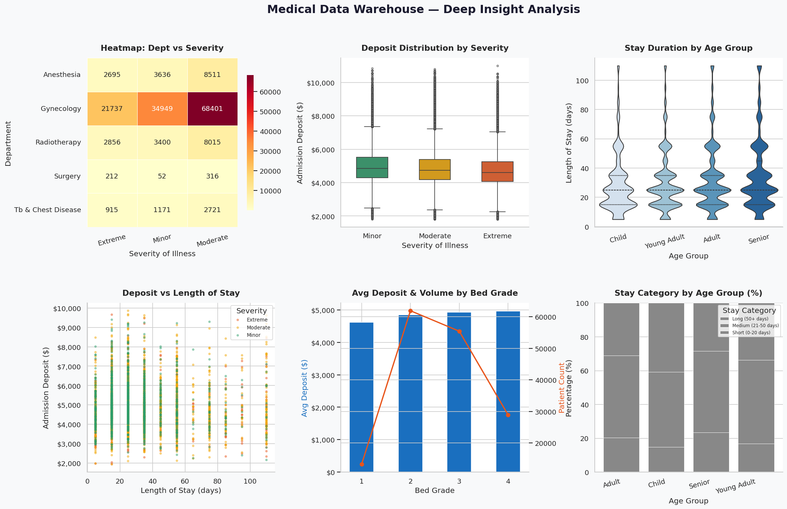
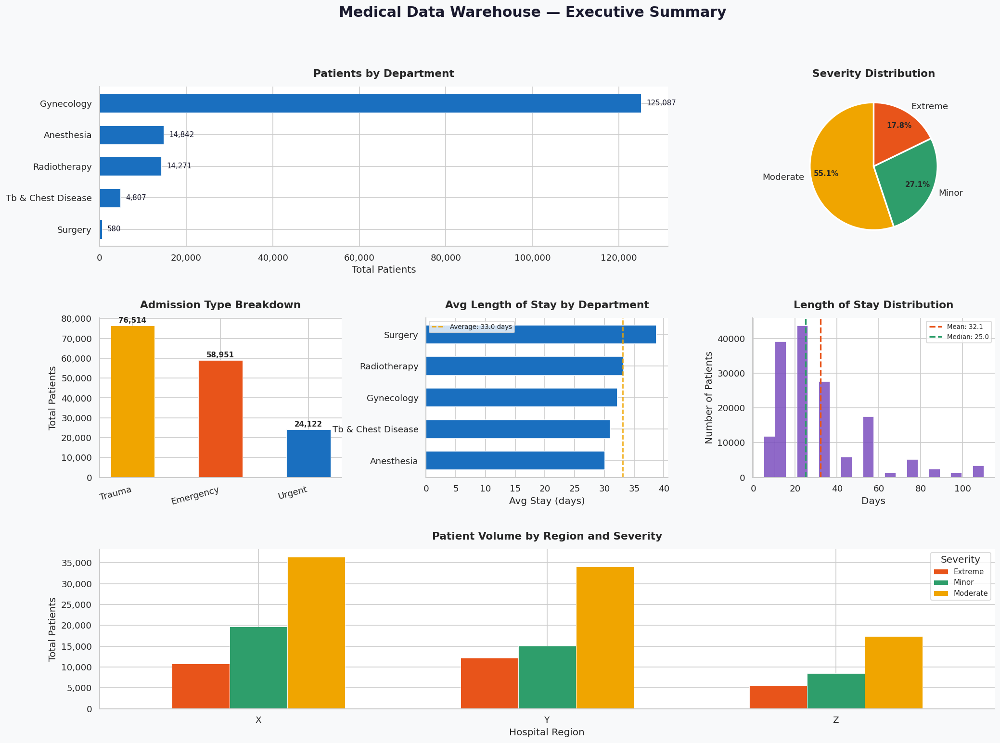

# Medical Data Warehouse — Azure Data Engineering

> End-to-end data engineering pipeline processing 318,000+ 
> patient records using Azure cloud services, PySpark, 
> and AI-powered Power BI analytics.

## Live Dashboard

## Architecture

## Tech Stack
| Layer | Tool | Purpose |
|---|---|---|
| Storage | Azure Data Lake Gen2 | Raw + clean data lake |
| Warehouse | Azure Synapse Analytics | SQL queries + views |
| Processing | Apache Spark / PySpark | Data cleaning + ELT |
| Language | Python 3 | UDFs + visualisation |
| Visualisation | Power BI Desktop | Interactive dashboard |
| Charts | Seaborn + Matplotlib | Notebook inline charts |
| Format | Apache Parquet | Silver + gold layers |

## Pipeline Overview

### Phase 1 — Ingestion (Bronze layer)
- Uploaded medical CSV to ADLS Gen2 raw-data container
- Created external SQL table in Synapse Serverless pool
- Built `bronze_patients` view using OPENROWSET over CSV
- Ran 20+ SQL data quality and analytics queries

### Phase 2 — Cleaning (PySpark notebook)
- Fixed Excel date corruption affecting 78,139 rows
  (`20-Nov` → `11-20`)
- Removed duplicate `case_id` records
- Filled nulls: `Bed_Grade=2.0`, `Department=Unknown`
- Standardised text: UPPERCASE codes, Proper Case labels
- Engineered new columns:
  - `Age_Numeric` — converted range string to integer
  - `Stay_Numeric` — converted range string to integer
  - `Age_Group` — Child / Young Adult / Adult / Senior
  - `Stay_Category` — Short / Medium / Long stay
  - `Is_Emergency` — binary flag
  - `Is_High_Severity` — binary flag

### Phase 3 — Storage (Silver + Gold layers)
- Wrote clean data as Parquet to silver layer
  (partitioned by `Hospital_region_code`)
- Aggregated gold layer grouped by Department,
  Severity, Age_Group, Stay_Category

### Phase 4 — SQL Views
- Created `silver_patients` view over Parquet
- Created `gold_patient_stats` view over aggregated Parquet
- Both queryable via Synapse Serverless SQL endpoint

### Phase 5 — Visualisation
- Connected Power BI to Synapse SQL endpoint
- Built 2-page dashboard:
  - Page 1: Executive summary (gold layer)
  - Page 2: Deep insight analysis (silver layer)
- AI features: Key Influencers, Smart Narrative, Q&A
- Built 12 Seaborn/Matplotlib charts in PySpark notebook

## Data Quality Improvements
| Issue | Before | After |
|---|---|---|
| Excel date corruption | 78,139 broken values | 100% fixed |
| Duplicate records | Present | 0 duplicates |
| Null bed grades | Present | Filled with median |
| Mixed text casing | Inconsistent | Fully standardised |
| Text range columns | Age/Stay as text | Numeric midpoints added |

## Key Dashboard Insights
- Radiotherapy is the busiest department
- X% of admissions are emergency cases
- Extreme severity patients stay X days longer on average
- Senior age group has highest proportion of extreme cases

## Screenshots

### Power BI Dashboard — Page 1 (Executive Summary)

### Power BI Dashboard — Page 2 (Deep Insight Analysis)

### PySpark Notebook Charts

## How to Reproduce
1. Create Azure Resource Group in Australia East
2. Create ADLS Gen2 storage account
   - Enable hierarchical namespace
   - Create `raw-data` container
   - Upload your CSV to `bronze/patients/`
3. Create Azure Synapse Analytics workspace
   - Link to your ADLS Gen2 account
4. Run SQL scripts in `/sql/` folder in order (01 → 08)
5. Run PySpark notebook in `/notebooks/` folder
6. Open `.pbix` file in Power BI Desktop
7. Update server endpoint to your Synapse workspace

## Azure Services Used
- Azure Resource Group (resource container)
- Azure Data Lake Storage Gen2 (data lake)
- Azure Synapse Analytics — Serverless SQL Pool
- Azure Synapse Analytics — Spark Pool
- Power BI Desktop + Power BI Service

## Author
**NAZIA AFRIN**
Charles Darwin University — MASTERS of DATA SCIENCE
